# Event Flutter – UI Demo

A vibrant Flutter UI demo for event booking, conference, or ticketing apps.  
This is a **UI-only** project focused on design and layout—no backend or live data included.

---

## 📱 Overview

Includes polished UI screens for a full event experience, such as:

- Event listings and categories
- Event detail pages
- Booking and ticket screens
- Speaker profiles
- Schedule and calendar views

---

## 🔍 Status

**Demo only** – No backend integration or working functionality.

---

## 📸 Screenshots

<table>
  <tr>
    <td></td>
    <td></td>
    <td></td>
    <td></td>
  </tr>
  <tr>
    <td>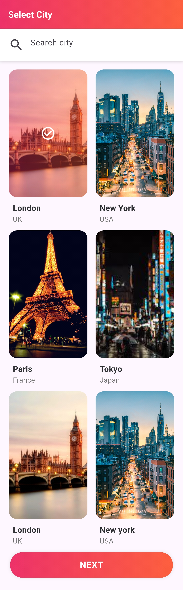</td>
    <td>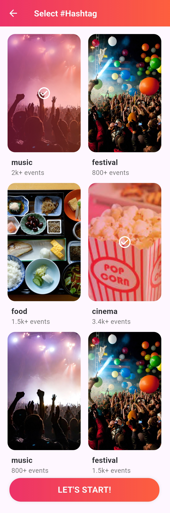</td>
    <td>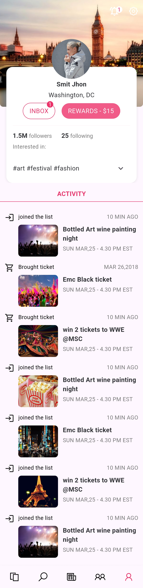</td>
    <td>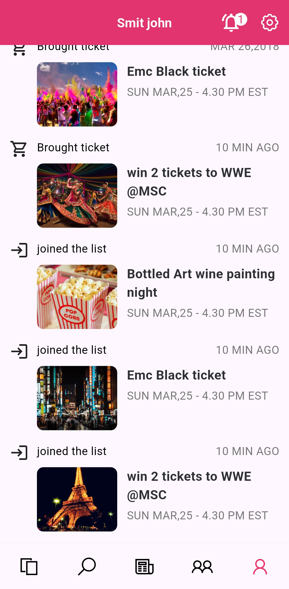</td>
  </tr>
  <tr>
    <td></td>
    <td></td>
    <td>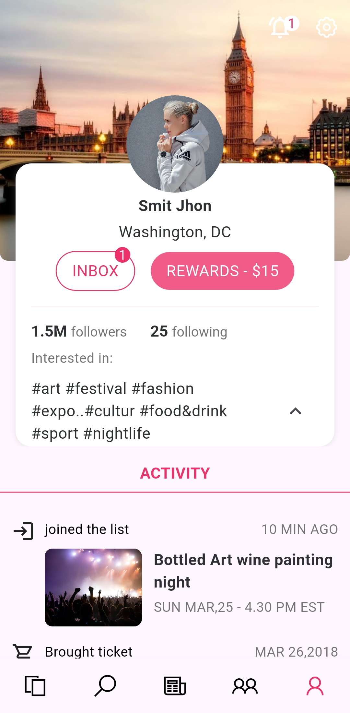</td>
  </tr>
  <tr>
    <td>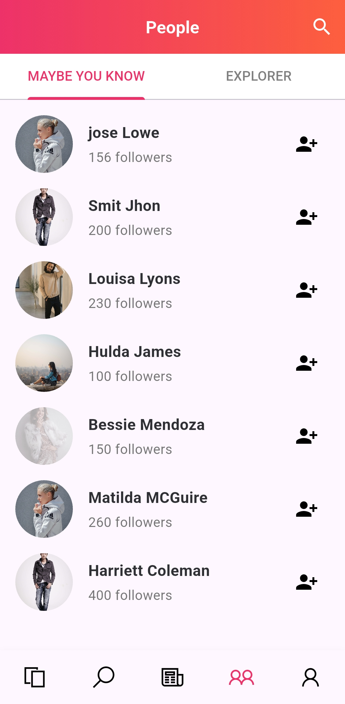</td>
    <td>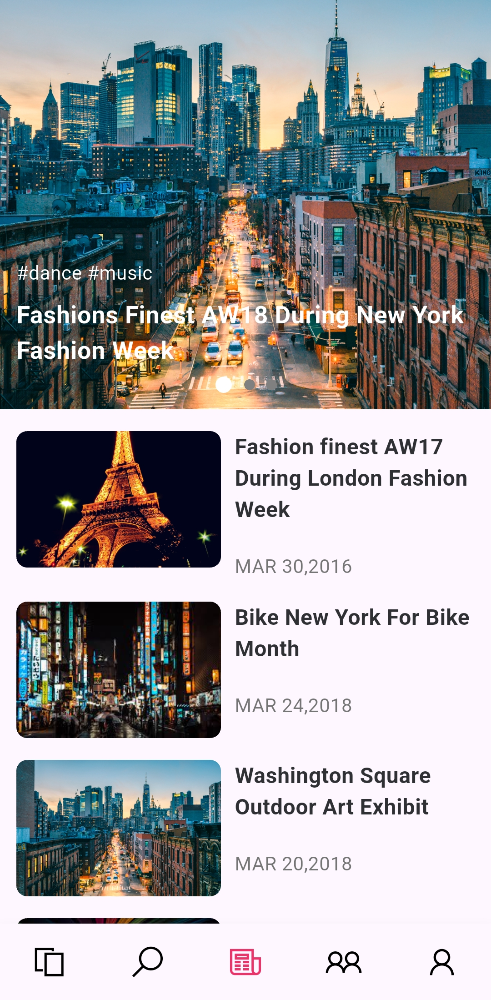</td>
    <td>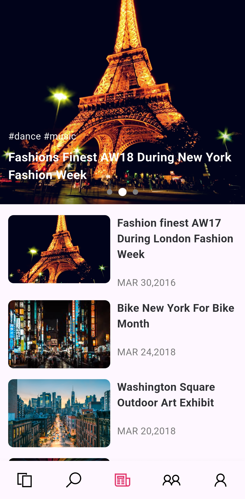</td>
    <td>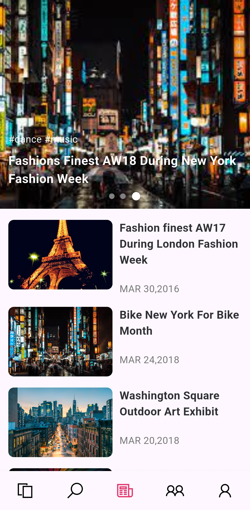</td>
  </tr>

  <tr>
    <td>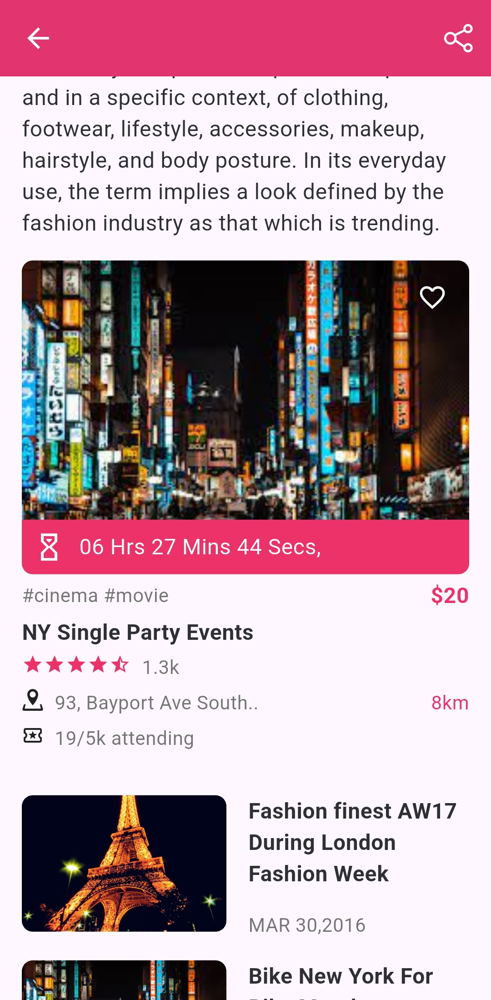</td>
    <td>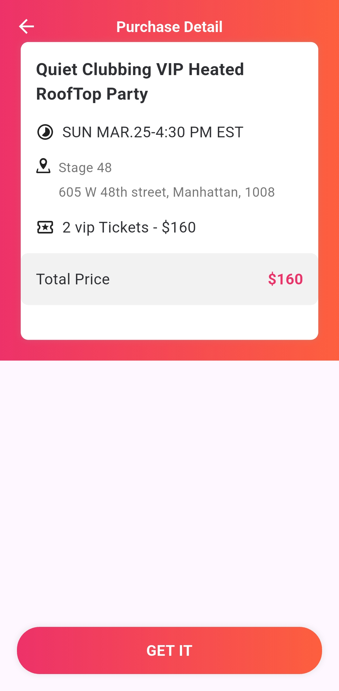</td>
    <td>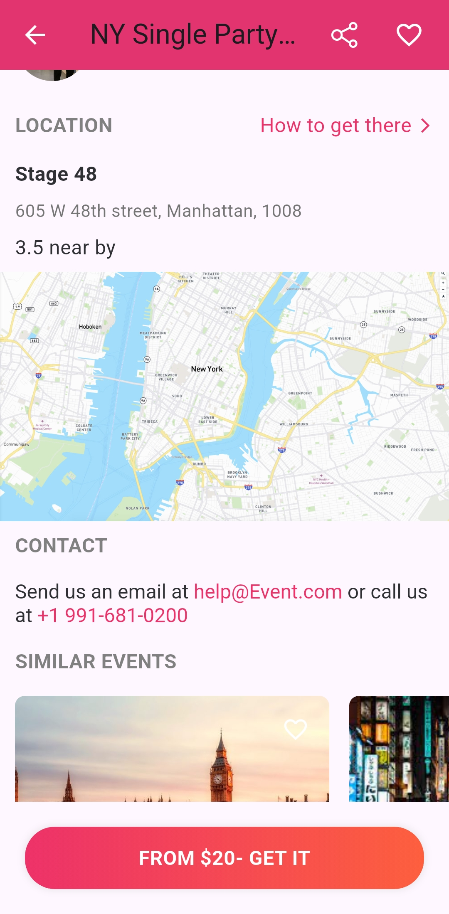</td>
    <td>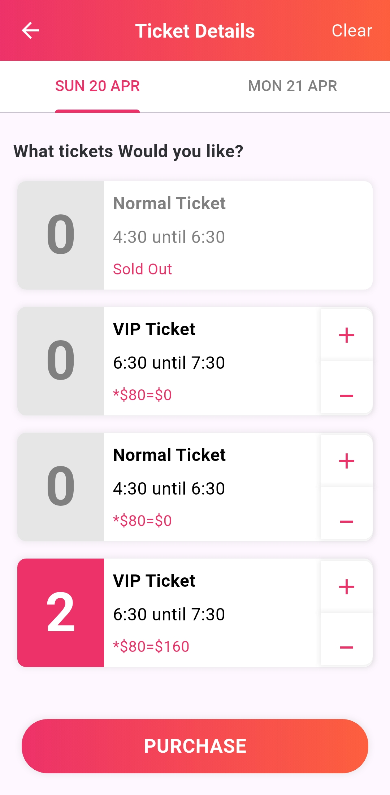</td>
  </tr>
  <tr>
    <td>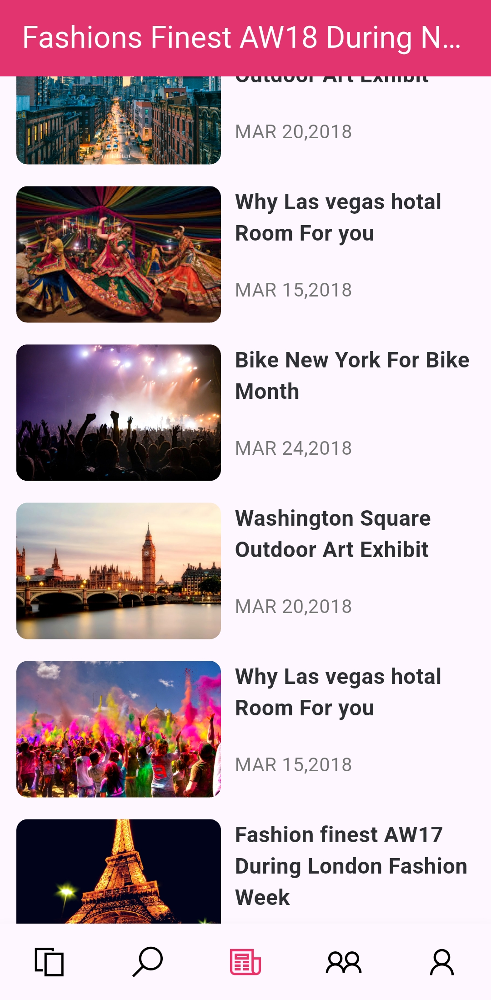</td>
    <td>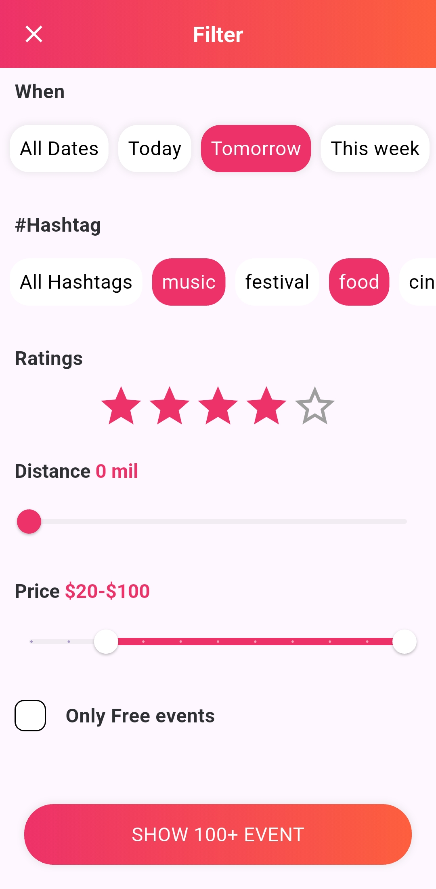</td>
    <td>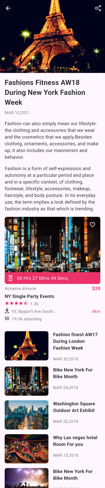</td>
    <td></td>
  </tr>
  <tr>
    <td>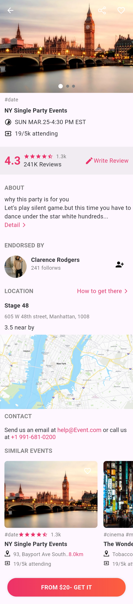</td>
    <td></td>
    <td>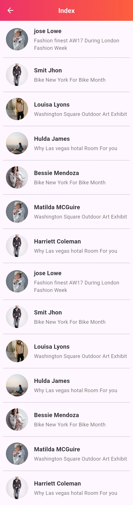</td>
    <td></td>
  </tr>
</table>

---

## 📝 Notes

- Built with Flutter
- Ideal for event planners, booking apps, or conference platforms
- Modular and easy to customize UI

---

## ✍️ Created by

**Mohamed Ebrahim**
